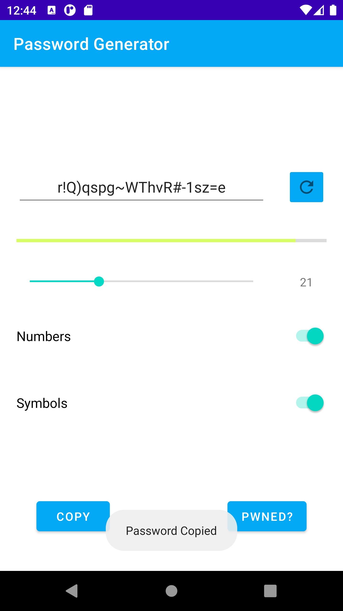
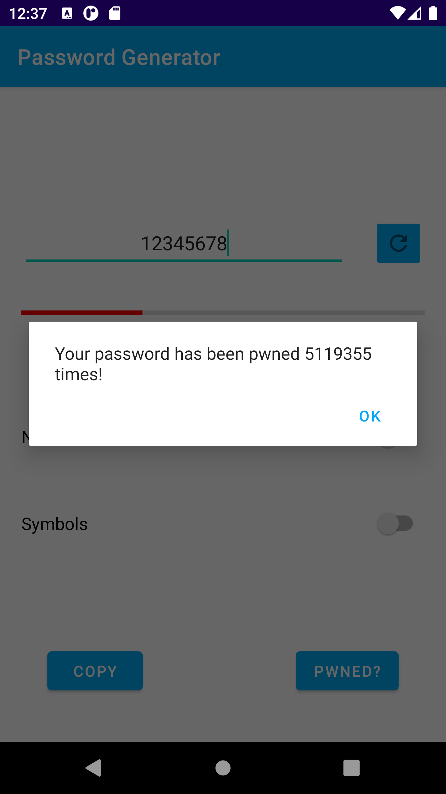
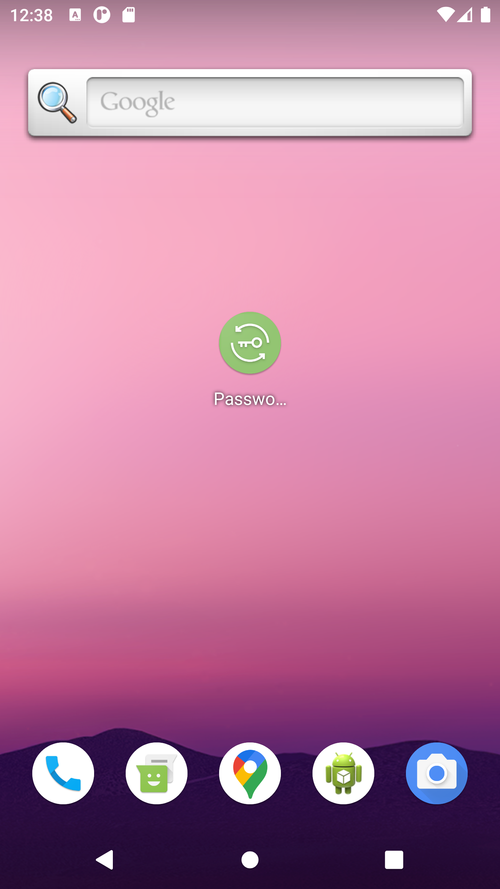

# Password Generator
The aim of this application is to provide passwords generated randomly. It is easy to use thanks to its simple user interface that contains intuitive buttons and switches.

As soon as the app is opened, a new password is already generated. Using the refresh button it is possible to generate another one and, thanks to the switches, it is possible to add numbers and special characters while thanks to the seekbar it is possible to increase its length.

It is also possible to see how strong the password is and how difficult to guess thanks to a simple algorithm (not very accurate) that can calculate a value from 0 to 10 and display it on the progressbar.

It is also possible to insert one of our passwords in the editText to see how strong it is.

Furthermore, in the section below there are two buttons that allow us to copy our newly created password to the clipboard and to find, thanks to the API provided by the site https://haveibeenpwned.com/, how many times this password has been found and forced to access some website.

### Pwned button details
The API explanation can be found at https://haveibeenpwned.com/API/v2#SearchingPwnedPasswordsByRange.
The purpose of this feature is to somehow send our password through a GET request to the site https://api.pwnedpasswords.com/range/{first 5 hash chars}.

In order to protect the value of the source password being searched for, the password must be searched for by partial hash. The hash is created using the SHA-1 algorithm and we have to write its first 5 chars into the url.

When a password hash with the same first 5 characters is found in the Pwned Passwords repository, the API will respond with an HTTP 200 and include the suffix (the characters following the first 5 already used) of every hash beginning with the specified prefix, followed by a count of how many times it appears in the data set. Then we have to search the results of the response for the presence of our source hash and if not found, the password does not exist in the data set.

### Various views
##### Create new password

#### Copy password

#### Check pwned password

#### Icon

